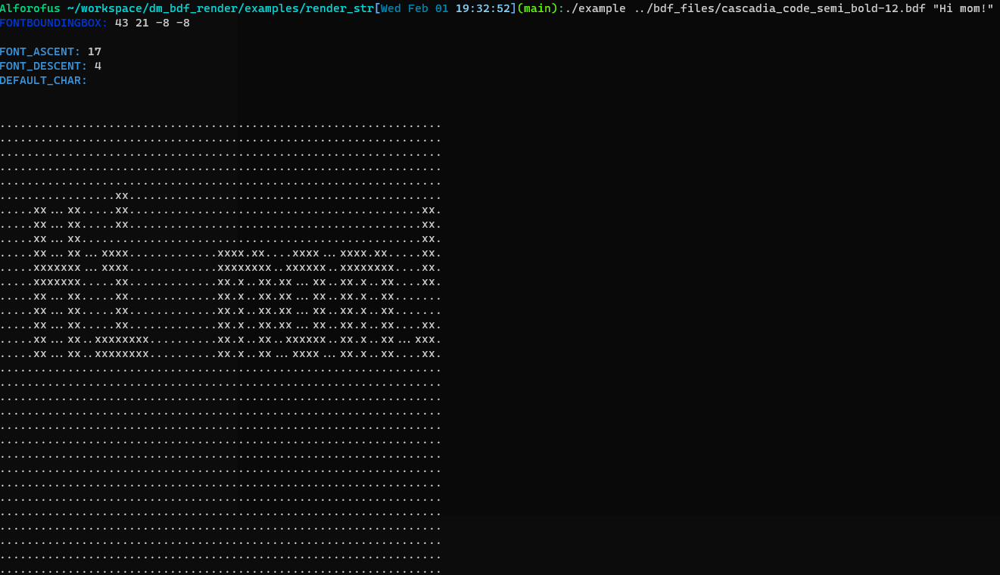
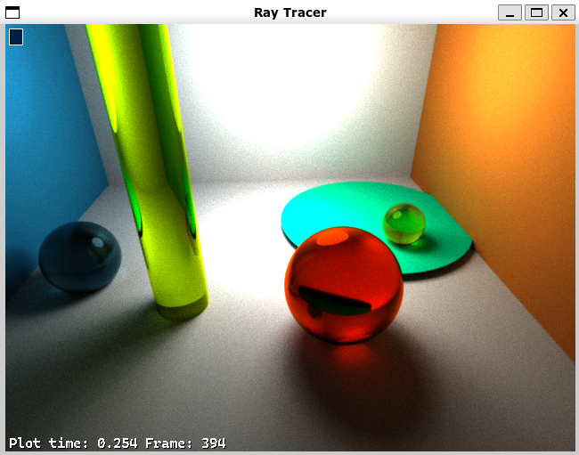

# dm_bdf_render library for displaying bdf fonts in C

This library was made and tested on MacOS and WSL2 Ubuntu enviroment.
It uses bdf font which is lightweight compared to ttf or similar font types that use vectors to draw glyphs. Downside is that font isn't scalable.

# HOW TO USE

  - Clone the repository;
  - From command line move into the root of repository and type Make;
 
This creates dm_bdf_render.a which is a static library. Link your source code through the compiler and you will be able to access function that prints single glyph or whole string. 

If you want test out rendering certain strings in specific font, try out example folder.

  - From command line move into `dm_bdf_render/examples/render_str` and type Make;
  - Run the executable `./example ../bdf_files/cascadia_code_semi_bold-12.bdf "Hi mom!"
  - Voila!
</img>

The other example will teach you how to load font and check its properties. You can find this example in `dm_bdf_render/examples/load_and_print_font_info`.

Now if you want it to run with real window and graphics library, you'll need to setup those yourself. Example file mentioned above should give you enough info about it. 
Important thing that you need to do is create a function that sets single pixel into the window. That function needs to be prototyped exactly the same way as the one in example. So the function render_str is prototyped and called like this:
```
t_2i    render_str(char *str, t_pxl *pxl, t_2i *crds, t_uint color);
render_str("Hi mom", &(t_pxl){font, &put_pixel, screen}, &(t_2i){0, 0}, 0xFFFFFF);
```
Arguments of the function are following:

1) Characters you want to display;
2) pxl struct which holds font struct, put_pixel function, and an argument that's passed to that put_pixel function;
3) 2d coordinates of the screen, stored as t_2i struct;
4) Color of the pixel;

# dm_bdf_render library alongside SDL2.

</img>

**__DISCLAIMER! The library won't create magical scene like the one you see above, it will create only the characters, similar to ones you can see in bottom left of the image. :)__**
